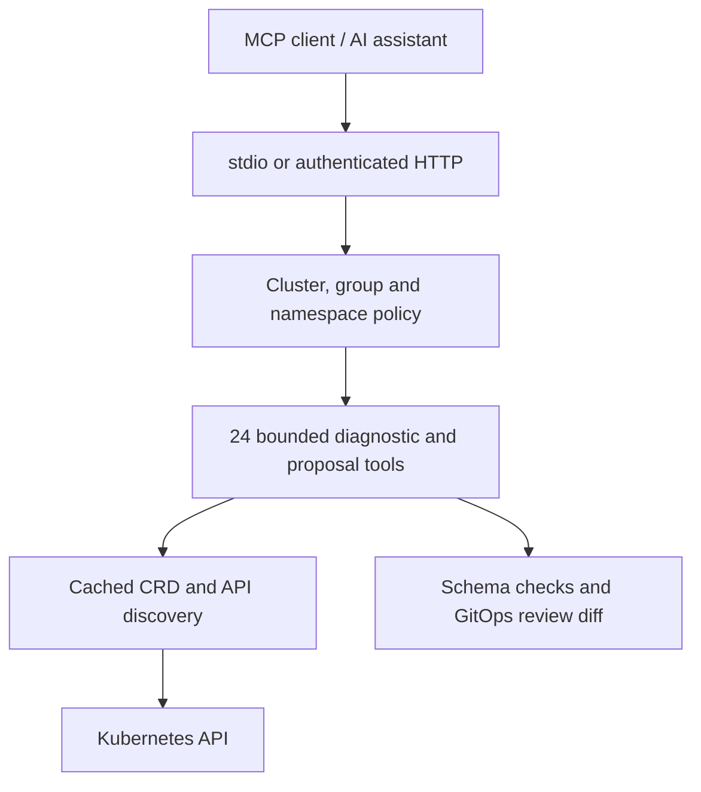

# Crossplane Compass

**Understand your control plane. Diagnose with evidence. Propose changes through GitOps.**

Crossplane Compass is an independently implemented MCP server for platform engineers and AI assistants. It connects installed Crossplane APIs to 24 focused tools over **stdio** or authenticated **Streamable HTTP**. It works from actual CRD schemas, scope and API discovery—not hard-coded cloud resources or guessed plural names.

**Release:** `v0.1.0` · **License:** Apache-2.0 · **Runtime:** Python 3.12+ · **Deployment:** Helm / container / local

> Initial release, not a zero-bug guarantee. See [validation evidence](docs/validation.md) for checks actually run and live-cluster gates still to run. Published image/chart URLs become available only after you push this repository and the release workflow succeeds.

## Why Compass?

| Question | Capability |
|---|---|
| “Why is this claim or XR stuck?” | Scope-aware dependency tracing, conditions, UID-scoped events and package health |
| “Which Azure account does this MR represent?” | Exact external-name lookup with explicit pagination |
| “Why does my manually set field keep reverting?” | Controller ownership, owner UID verification and adoption assessment |
| “What can developers request?” | Searchable XRD catalog and installed CRD schema inspection |
| “Generate an XR without hallucinating fields.” | Required-field scaffolding, typed validation and a redacted review diff |
| “What could this composition revision affect?” | Revision comparison and paginated consumer/update-policy inspection |
| “Can I migrate this resource safely?” | Observe/Orphan, external identity, scope and ownership checks—without claiming cloud verification |
| “Can I expose this to an assistant?” | No persistent mutation tools, explicit cluster/group/namespace policy, authenticated HTTP and minimal chart permissions |

## Start locally

Install [uv](https://docs.astral.sh/uv/getting-started/installation/), clone or extract this repository, and use a **trusted** kubeconfig:

```bash
uv sync --frozen
uv run crossplane-compass --version
uv run crossplane-compass   --context dev=your-kubeconfig-context   --groups platform.example.org,cosmosdb.azure.upbound.io   --namespaces team-a
```

The last command starts the stdio MCP server; it waits for an MCP client and does not print a chat UI. Use your actual API groups from `kubectl api-resources`. Only the explicitly selected context is exposed. When `--context` is omitted, alias `default` uses in-cluster credentials or the current kubeconfig context.

### MCP client

```json
{
  "mcpServers": {
    "crossplane-compass": {
      "command": "uv",
      "args": [
        "--directory", "/absolute/path/crossplane-compass",
        "run", "--frozen", "crossplane-compass",
        "--context", "dev=your-kubeconfig-context",
        "--groups", "platform.example.org,cosmosdb.azure.upbound.io"
      ]
    }
  }
}
```

For VS Code use `servers` instead of `mcpServers` and add `"type": "stdio"`. Desktop clients may need `KUBECONFIG` and `PATH` configured to find cloud authentication plugins.

## Install with Helm

Build and push your image first, or use the image from your successful GitHub release:

```bash
export IMAGE=ghcr.io/YOUR_OWNER/crossplane-compass
# For a local build published manually:
docker build -t "$IMAGE:v0.1.0" .
docker push "$IMAGE:v0.1.0"

kubectl create namespace compass
# Generate locally; do not commit or paste the token into a chat.
umask 077
openssl rand -hex 32 > token
kubectl -n compass create secret generic crossplane-compass-auth --from-file=token

helm upgrade --install compass ./charts/crossplane-compass   --namespace compass   --set fullnameOverride=crossplane-compass   --set image.repository="$IMAGE"   --set image.tag=v0.1.0   --set 'access.groups={platform.example.org,cosmosdb.azure.upbound.io}'   --wait

kubectl -n compass port-forward svc/crossplane-compass 8080:8080
```

Connect an HTTP-capable MCP client to `http://localhost:8080/mcp`, with `Authorization: Bearer <contents-of-token>`. Keep the local token file private or import it into your secret manager and remove it. For remote access, use TLS through your authenticated gateway. The Helm service is ClusterIP; no public ingress is created.

The release workflow also publishes `oci://ghcr.io/YOUR_OWNER/charts/crossplane-compass`, version `0.1.0`, with the released image digest embedded. See [installation](docs/installation.md) for Flux, namespace isolation, network policy and dry-run permissions.

## Architecture



The MCP host supplies the language model. Compass does not require an LLM key, vector database or cloud credentials of its own. Provider credentials remain in the cluster; Compass never reads Kubernetes Secrets. Kubeconfig credentials authenticate only to the Kubernetes API.

## Tools at a glance

- **Discover:** `clusters_list`, `discover`, `catalog_search`, `resource_schema`
- **Inspect:** `resources_list`, `resource_get`, `resource_events`, `inventory_summary`, `external_lookup`
- **Diagnose:** `resource_trace`, `diagnose`, `packages_health`, `resource_owners`, `provider_config_check`, `incident_bundle`
- **Compose:** `composition_explain`, `composition_compare`, `composition_impact`
- **Propose:** `manifest_scaffold`, `manifest_validate`, `manifest_plan`
- **Operate:** `adoption_check`, `migration_assess`, `deletion_assess`

See the [complete tool contract](docs/tools.md). Every cluster tool requires an explicit `cluster` alias. A small `compass://guide` MCP resource and `troubleshoot` prompt guide evidence-based use.

## Design boundaries

- No apply, delete, force-reconcile, finalizer removal, shell execution or cloud API calls.
- Optional Kubernetes **server-side dry-run** is disabled by default. Its RBAC needs patch permissions, even though the application always sends `dryRun=All`.
- Local schema validation covers a JSON Schema/OpenAPI subset. It does not execute CEL or admission webhooks, render functions, estimate cost or guarantee provider behavior.
- Compact summaries are default; detailed manifests are opt-in. Redaction cannot guarantee removal of credentials embedded in arbitrary strings. Review incident exports.
- HTTP uses a shared bearer credential, not OAuth or per-user Kubernetes impersonation. Deploy a separate instance/service account for each trust boundary.
- Crossplane v2 can compose ordinary Kubernetes resources; this release traces only allowed **CRD-backed resources**, not core Secrets, Deployments or arbitrary core objects. Unavailable references are explicit errors.

## Documentation

[Install](docs/installation.md) · [Tools](docs/tools.md) · [Architecture](docs/architecture.md) · [Security](SECURITY.md) · [Examples](docs/examples.md) · [Reference review](docs/reference-review.md) · [Release process](docs/releases.md) · [Contribute](CONTRIBUTING.md) · [Validation](docs/validation.md) · [Changelog](CHANGELOG.md)

## Development

```bash
uv sync --frozen
make check
make build
make chart  # Helm 3.19+ required
```

Contributions are welcome. Start with [CONTRIBUTING.md](CONTRIBUTING.md): local setup, repository map, tool extension recipe, testing expectations and PR checklist are included.
